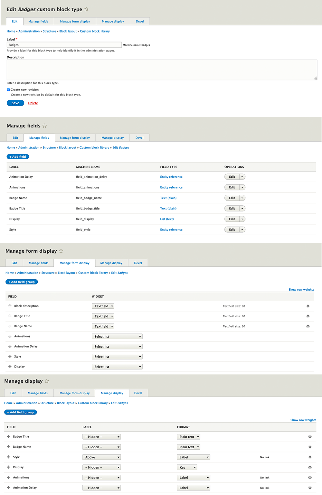

# *Add to the SUBTHEME.libraries.yml*

gt-badges: 
version: "1.0.x" 
css: 
theme: 
templates/block/custom/badges/css/gt-badges.css: {} 
js: 
dependencies: 
- core/jquery 

# *Add to the repositories section in SUBTHEME composer.json*

"repositories": [ 
{  
"type": "vcs",  
"url": "https://github.gatech.edu/ICWebTeam/block_badges.git"  
}
# *Add to the require in SUBTHEME composer.json*

"require": {  
"gt/badges": "dev-master"  
"mnsami/composer-custom-directory-installer": "^2.0" 
},

# *Add to the installer paths in SUBTHEME composer.json*
"installer-paths": {  
"web/themes/contrib/SUBTHEME/templates/block/custom/badges": [  
"gt/badges"  
]  
},

# *Implements hook_page_attachments_alter(). in subtheme.theme*
function SUBTHEME_page_attachments_alter(&$page) { 
$page['#attached']['library'][] = 'SUBTHEME/badges'; 
}

# **CUSTOM BLOCK  SET-UP**

# **TAXONOMY SET-UP**

